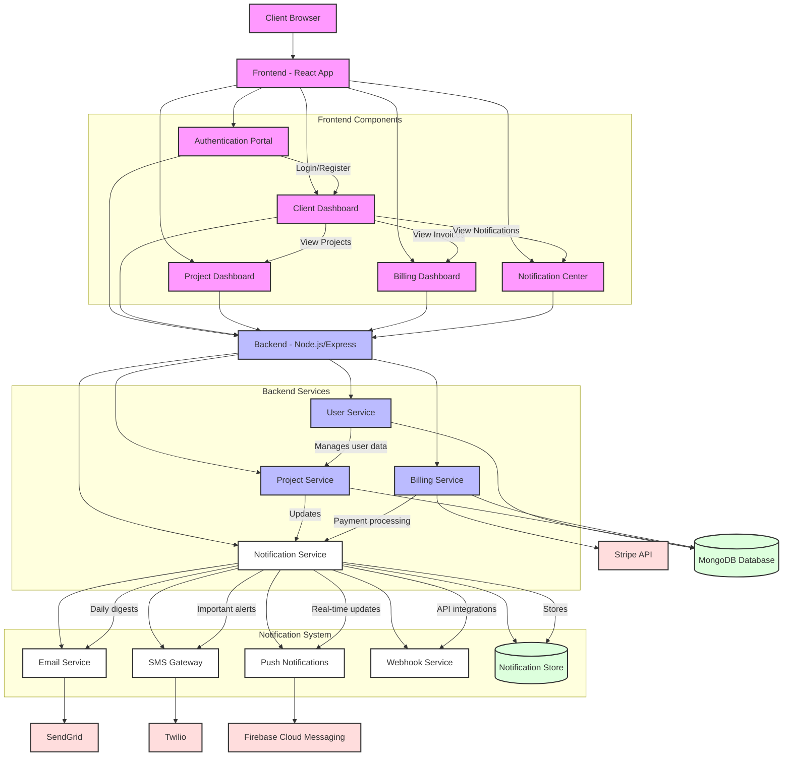

## System Architecture Overview

### Frontend Components
- **Authentication Portal**: Handles user registration and login
- **Client Dashboard**: Main interface for clients to view project overview
- **Project Dashboard**: Detailed project progress and updates
- **Billing Dashboard**: Invoice history and payment management
- **Notification Center**: Centralized hub for all notifications

### Backend Services
- **User Service**: Manages user accounts and authentication
- **Project Service**: Handles project creation, updates, and tracking
- **Billing Service**: Processes payments via Stripe integration
- **Notification Service**: Multi-channel notification delivery system

### Notification Channels
1. **Email Notifications** (via SendGrid):
   - Project milestone updates
   - Weekly progress reports
   - Invoice and payment receipts
   - Account security alerts

2. **SMS Alerts** (via Twilio):
   - Critical project updates
   - Payment reminders
   - Security verifications
   - Urgent communications

3. **Push Notifications** (via Firebase):
   - Real-time project updates
   - Chat messages
   - Task completions
   - Timeline changes

4. **Webhook Service**:
   - Third-party integrations
   - Custom client notifications
   - API event broadcasts
   - Automation triggers

### External Integrations
- **Stripe API**: Secure payment processing
- **SendGrid**: Transactional emails
- **Twilio**: SMS messaging
- **Firebase**: Push notifications

### Databases
- **Main Database (MongoDB)**: User data, project information, billing history
- **Notification Store**: Notification templates, delivery status, user preferences

### Key Features
1. Multi-channel notification delivery
2. Real-time and scheduled notifications
3. Notification preferences management
4. Delivery status tracking
5. Template-based notifications
6. Rate limiting and throttling
7. Notification analytics and metrics
